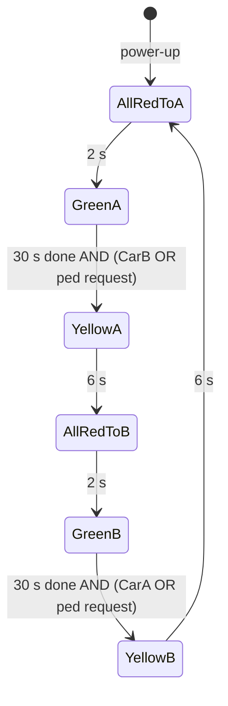

# Traffic Light Controller – Design

2026-10-09 · Ladder test for the codesys-st skill

## Overview

A two-lane traffic light, written in ladder as the first real test of the codesys-st ladder compiler. Green rests on one lane until a car waits in the other lane or a pedestrian presses the button. It then changes through yellow (6 s) and all-red (2 s), and never gives a lane less than 30 s of green. If the controller stops, every lane fails to red.

Design basis (confirmed 2026-10-09):

- Two lanes, **A** and **B**, crossing each other. Each lane has one car-present detector and its own red, yellow and green lamp.
- Lane A gets green first after power-up.
- Pedestrians cross both lanes, and one button serves both crossings. Whichever lane is red can be crossed now, so a press only has to end the current green. That lets pedestrians cross the lane that was green. There are no walk lamps.
- The target is a ctrlX CORE (CODESYS V3). The logic lives in a ladder FB, called from a small program that maps the I/O.

## I/O

There are three digital inputs, six lamp outputs and one healthy output. All are BOOL. The names below are the GVL names. The FB pin names are the same without the `bDI_` / `bDO_` prefix.

| Signal | Direction | Meaning when TRUE |
| --- | --- | --- |
| `GVL_IO.bDI_CarA` | Input | A car is waiting or present in lane A (from the external detector) |
| `GVL_IO.bDI_CarB` | Input | A car is waiting or present in lane B |
| `GVL_IO.bDI_PedButton` | Input | The pedestrian button is pressed (momentary) |
| `GVL_IO.bDO_RedA` | Output | Lane A red lamp |
| `GVL_IO.bDO_YellowA` | Output | Lane A yellow lamp |
| `GVL_IO.bDO_GreenA` | Output | Lane A green lamp |
| `GVL_IO.bDO_RedB` | Output | Lane B red lamp |
| `GVL_IO.bDO_YellowB` | Output | Lane B yellow lamp |
| `GVL_IO.bDO_GreenB` | Output | Lane B green lamp |
| `GVL_IO.bDO_SignalOk` | Output | Controller running; holds the fail-to-red relay energised (see [Power-up, faults and safety](#power-up-faults-and-safety)) |

The FB also outputs `eState` (the current state) for the online view and an HMI.

## Timing and switching rules

Three times govern the cycle. Each is a `VAR CONSTANT` in the FB, so it can be changed in one place.

| Constant | Value | Rule |
| --- | --- | --- |
| `GREEN_MIN_TIME` | 30 s | A green stays on for at least this long, even if demand arrives at once |
| `YELLOW_TIME` | 6 s | Yellow is on for exactly this long |
| `ALL_RED_TIME` | 2 s | Both lanes are red for this long before the other lane turns green |

- **Switch only on demand.** After its 30 s, a green ends only when there is demand: a car in the *other* lane (`bCarB` while A is green, `bCarA` while B is green), or a stored pedestrian request. With no demand, the green stays on for as long as it takes.
- **Cars in the green lane don't hold the green.** If both lanes have cars, the lights alternate every 30 s + 6 s + 2 s = 38 s per lane.
- **The pedestrian request is stored.** One press is enough: it's latched until it's served. It's cleared when a lane turns green, because that change is the one the pedestrian was waiting for. A press during yellow or all-red is served by the change already under way. A press during green is held until the next change.
- **Car inputs aren't stored.** They're levels: a car that leaves before the minimum green has passed no longer asks for a change.

## State machine

Six states run in a fixed ring. Only the two green states wait on demand; every other state moves on when its timer runs out.

| # | State | Lane A | Lane B | Step time | Leaves when | Goes to |
| --- | --- | --- | --- | --- | --- | --- |
| 0 | `AllRedToA` | Red | Red | 2 s | Timer done | `GreenA` |
| 1 | `GreenA` | Green | Red | 30 s (minimum) | Timer done AND (`bCarB` OR ped request) | `YellowA` |
| 2 | `YellowA` | Yellow | Red | 6 s | Timer done | `AllRedToB` |
| 3 | `AllRedToB` | Red | Red | 2 s | Timer done | `GreenB` |
| 4 | `GreenB` | Red | Green | 30 s (minimum) | Timer done AND (`bCarA` OR ped request) | `YellowB` |
| 5 | `YellowB` | Red | Yellow | 6 s | Timer done | `AllRedToA` |
| — | any other value | — | — | — | Always | `AllRedToA` |

Each lamp is a single coil, driven by the state:

- `bRedA` is on in `AllRedToA`, `AllRedToB`, `GreenB` and `YellowB`.
- `bYellowA` is on in `YellowA`, and `bGreenA` in `GreenA`.
- Lane B is the mirror image.

No state lights green or yellow on both lanes, so a conflicting green can't come out of the state machine (but see [Power-up, faults and safety](#power-up-faults-and-safety)).

## Power-up, faults and safety

- **Power-up starts in all-red.** `AllRedToA` is enum value 0, the default, so the first thing the light does is hold both lanes red for 2 s and then give lane A green. Nothing has to run on the first scan.
- **Unknown state:** any value outside the enum (e.g. after an online change) goes to `AllRedToA`. That's this design's `CASE ELSE`. There's no `Faulted` state, because there's no fault input and no reset button to leave it.
- **No jumps section.** There are no fault, abort or timeout conditions in this test, so section 1 of the house structure is empty, along with its commit.
- **Fail state is steady red on both lanes.**
    - *Inside the program:* the only fault is an invalid state value, and it goes to all-red (`AllRedToA`).
    - *Controller stop or crash:* the PLC can't drive anything, and its outputs fall to FALSE, which would leave every lamp dark. So the red lamps also need a hardware path. `bDO_SignalOk` drives a "signal OK" relay. Each red lamp is powered by its PLC output **or** a normally closed contact of that relay, in parallel. While the program runs, the relay is energised, its contacts are open, and the PLC alone drives red. When the PLC stops, the relay drops out and every red comes on. The relay also needs a contact that breaks the yellow and green supply, so that a frozen output can't hold a green.
    - `bDO_SignalOk` is written by one unconditional rung, so it's TRUE whenever the program is executing. A crash or a stopped task drops it. The output wiring is designed to fail safe, so no heartbeat is needed.
- **Safety boundary:** in a real signal, conflicting greens must be prevented by a hardware conflict monitor, not by this PLC code. This test only shows that the state machine never asks for one.

## Implementation plan

The FB is written in ladder with the house sequence structure. Jumps and transitions write `_eNextState`, and a commit network moves it into `_eState` after the transitions section.

| Object | Language | Contents |
| --- | --- | --- |
| `E_TrafficState` | DUT | `AllRedToA := 0, GreenA, YellowA, AllRedToB, GreenB, YellowB`, `qualified_only` |
| `FB_TrafficLight` | Ladder | The sequence below. Inputs `bCarA`, `bCarB`, `bPedButton`. Outputs the six lamps and `eState` |
| `GVL_IO` | GVL | The ten I/O signals |
| `PRG_Traffic` | Ladder | Network 1: `-> GVL_IO.bDO_SignalOk` (unconditional). Network 2: `-> fbTrafficLight(...)` on EN/ENO, with every `GVL_IO` signal wired to a named pin |

Networks of `FB_TrafficLight`, in order:

| Section | Networks |
| --- | --- |
| Inputs | `Ped request`: `bPedButton -> S:_bPedRequest` |
| 1. Jumps | none (see above) |
| 2. Transitions | One per arrow in the state machine, e.g. `[_eState = E_TrafficState.GreenA] _fbStepTimer.Q (bCarB \| _bPedRequest) -> _eNextState := E_TrafficState.YellowA`, then the invalid-state network `[_eState > E_TrafficState.YellowB] -> _eNextState := E_TrafficState.AllRedToA` |
| Commit | `-> _eState := _eNextState` |
| Decode | One network per state, `[_eState = E_TrafficState.GreenA] -> _bStGreenA`, so that entry actions and lamps use contacts. Compares in parallel branches import as an AND |
| 3. On change | `[_eState <> _eLastState] -> _bStateChanged`, one entry network per step time (`_tStepTime := GREEN_MIN_TIME` / `YELLOW_TIME` / `ALL_RED_TIME`), the entry of either green resets the request (`-> R:_bPedRequest`), then `-> _eLastState := _eState` |
| 4. Cyclic | Step timer inline (the rung is its IN) `/_bStateChanged _fbStepTimer(PT := _tStepTime)`, then one coil per lamp from the decoded state BOOLs, e.g. `(_bStAllRedToA | _bStAllRedToB | _bStGreenB | _bStYellowB) -> bRedA`, then `-> eState := _eState` |

Notes:

- **One step timer** times every state. Its preset is set on entry, and its IN is held off for the change scan so it restarts in each new state. `_tStepTime` is declared `:= ALL_RED_TIME`, because power-up enters `AllRedToA` without a state change, so no entry action sets it.
- **Two writers on the request latch.** `_bPedRequest` is set in the inputs network and reset on green entry. It's an internal register, not an output, so this is allowed. The set comes before the reset in scan order, so a button held while a green starts is cleared by the reset that follows. The request is then latched again on the next scan, while the button is still held. That's correct: the pedestrian is still asking.
- **Build:** run `st_to_plcopenxml.py` on the four sources to get one PLCopenXML file, run `ld_trace.py` on it, and check each coil against the state table above.

## Test plan

Run in the CODESYS simulator or on the ctrlX. Force the inputs and watch `eState`, the lamps and `_fbStepTimer.ET` in the online view.

| # | Scenario | Expected |
| --- | --- | --- |
| 1 | Power-up, no inputs | All red for 2 s, then A green. A stays green indefinitely |
| 2 | A green for > 30 s, then `bCarB` on | A yellow at once, 6 s, then all red 2 s, then B green |
| 3 | `bCarB` on 5 s after A turns green | A stays green until 30 s, then yellow |
| 4 | `bCarB` pulses on for 3 s at 10 s into A green, then off | No change: the car is gone by 30 s |
| 5 | Ped button tapped once (one scan) during A green at 10 s | A yellow at 30 s. The request clears when B turns green |
| 6 | Ped button tapped during A yellow | B green as normal, request cleared at B green. B stays green with no further demand |
| 7 | `bCarA` and `bCarB` both on | Lanes alternate: 30 s green, 6 s yellow, 2 s all red, each lane |
| 8 | Only `bCarA` on while A is green | A stays green (own-lane cars don't switch it) |
| 9 | Write an invalid value into `_eState` online | Next scan: all red (`AllRedToA`), then A green after 2 s |
| 10 | Any time | Never green or yellow on both lanes at once, and every red-to-green change has ≥ 2 s of all red before it |
| 11 | Stop the PLC while A is green | `bDO_SignalOk` drops, the relay drops out, both reds on, green and yellow off |

## Decisions

- [x] Yellow is 6 s.
- [x] Pedestrians cross both lanes, with one shared button.
- [x] One car detector per lane.
- [x] Lane A gets green first.
- [x] Fail state is steady red on both lanes.
- [x] No walk lamps.
- [x] Fail-safe is handled in the output wiring. `bDO_SignalOk` is a steady TRUE, not a heartbeat.
- [x] FB and program are both ladder.
